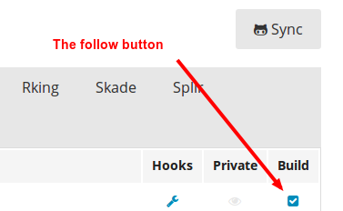

#Getting Started

[Arturo.io](http://arturo.io) is a build system for digital books.
Books are written in the [markdown](http://daringfireball.net/projects/markdown/syntax)
format and stored on [GitHub](https://github.com/).  Arturo reads the
`manifest.yml` file that provides most of the configuration and
customization.

##Step 1: Sign in

To get started with Arturo, sign in with your GitHub account.  Go to the [Arturo](http://arturo.io) homepage and click the *Authorize with Github* link.

While you sign in, GitHub will ask you for a set of access permissions for Arturo.
These have been highlighted [here](#permissions).

##Step 2: Follow a repository

Once you've signed in you will need to sync your repos from GitHub, go to your [repositories](https://arturo.io/repositories) section and click the *Sync*.

Sync will automatically refresh your repositories when they are ready. Once completed you will see all the organizations you're a member of.

Click the *follow* under the build column button to enable the repository on Arturo.

##Step 3: Add a manifest.yml

Arturo needs to know a little more about your repository in order to build your book. A file named `manifest.yml` will need to be created at your repositories root directory.  We'll cover more about a manifest in the *manifest builds* section and what options are available to you.

##Step 4: Trigger your first build

A build is triggered via a GitHub [webhook](https://developer.github.com/webhooks/). Every commit and every pull request will trigger a build on Arturo.  You can view your builds on the [Builds](https://arturo.io/builds) page.

You can also trigger a manual build via the *Test Hook* button on Github.

